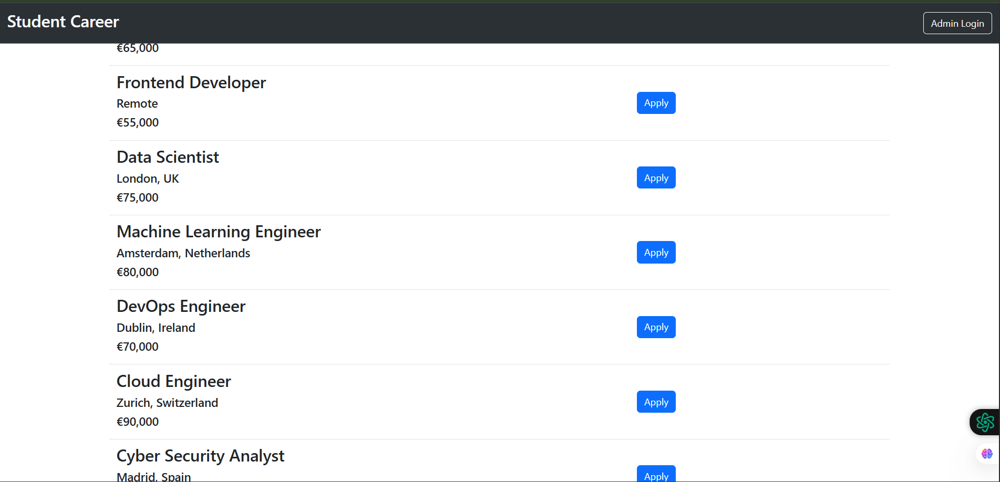
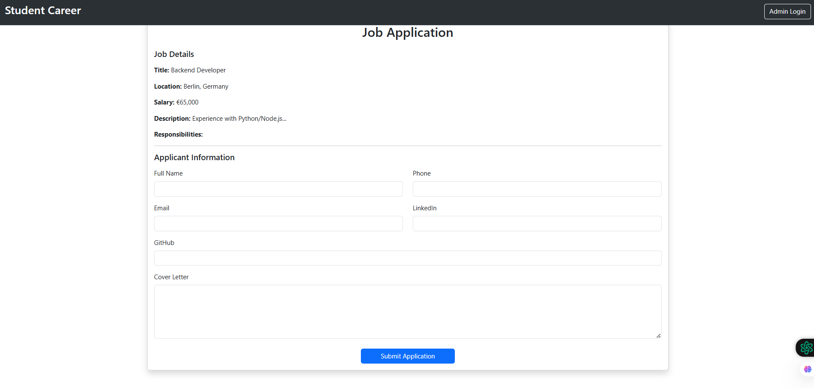
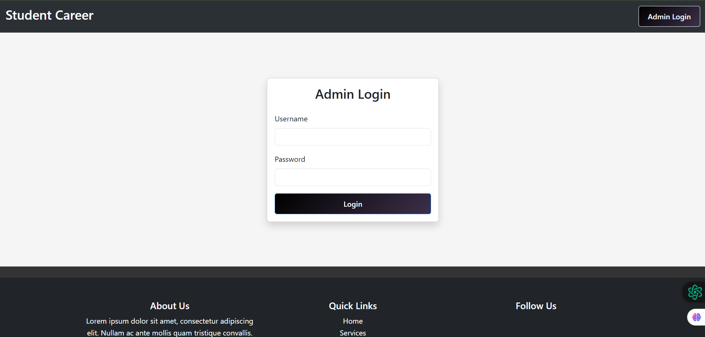
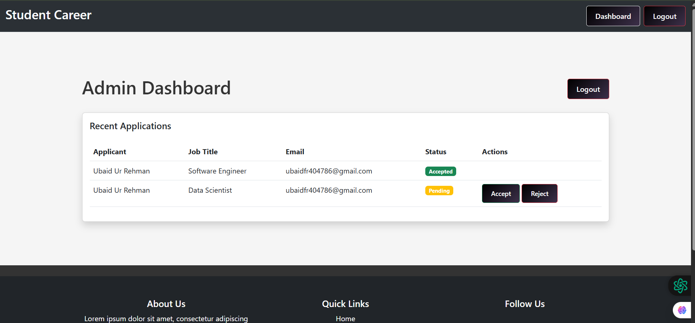

# Student Careers Website

A professional Flask-based job portal designed to help students explore various career paths and apply for opportunities. This project features dynamic job listings, a complete application system, and a dedicated admin dashboard for application management.


## Key Features
- **Dynamic Job Listings**: View up-to-date career opportunities fetched from a database.
- **Detailed Job Pages**: Each job has a dedicated page showing responsibilities, requirements, and salary.
- **Application System**: Integrated form for students to submit applications (Name, Email, Phone, Links, Cover Letter).
- **Admin Dashboard**: Secure dashboard (`/admin/login`) for administrators to:
  - View all submitted applications
  - Accept or Reject applications
  - Automatically send email notifications to applicants on status updates
- **Email Notifications**: Integrated with Flask-Mail for automated application confirmations and status updates.
- **Database Integration**: Secure storage for both job listings and applicant data.
- **Responsive Design**: Built with Bootstrap 5 to ensure a great experience on mobile and desktop.
- **Connection Stability**: Includes SQLAlchemy connection pooling and pre-pinging to ensure reliable database access.

## Tech Stack
- **Backend**: Python with Flask
- **Database**: PostgreSQL (Production) / MySQL (Testing compatibility)
- **ORM**: SQLAlchemy
- **Mailing**: Flask-Mail (SMTP)
- **Frontend**: HTML5, Jinja2, Bootstrap 5, CSS3

## Project Structure
```
/
├── app.py              # Main Flask application and routing
├── database.py         # Database connection and CRUD operations
├── static/             # Static assets (CSS, Images, SVGs)
├── templates/          # HTML Templates (Jinja2)
│   ├── base.html       # Master layout template
│   ├── admin_dashboard.html # Admin panel interface
│   ├── admin_login.html     # Secure login page
│   ├── home.html       # Homepage with job listings
│   ├── jobfrom.html    # Application form
│   └── application_submitted.html # Success page
└── replit.md           # Project configuration for Replit
```

## Database Information
**Note on Testing:** For current testing and demonstration purposes, we are using a **FreeMySQL** database. However, the system is fully compatible and easily switchable to a production-grade PostgreSQL or standard MySQL database by updating the `DATABASE_URL`.

- `jobs`: Stores job titles, locations, descriptions, and salaries.
- `applications`: Stores applicant details, application status (pending, accepted, rejected), and links to job IDs.

## Setup and Running
1. **Install Dependencies**:
   ```bash
   pip install flask sqlalchemy pymysql psycopg2-binary flask-mail
   ```
2. **Environment Variables**:
   Configure the following secrets/env vars:
   - `DATABASE_URL`: Your database connection string
   - `MAIL_USERNAME`: Your SMTP email address
   - `MAIL_PASSWORD`: Your SMTP app password
   - `SESSION_SECRET`: A secret key for session security
3. **Run Application**:
   ```bash
   python app.py
   ```
   The server will start on `0.0.0.0:5000`.
## Webpage
   
   
   
   
   
   
   
